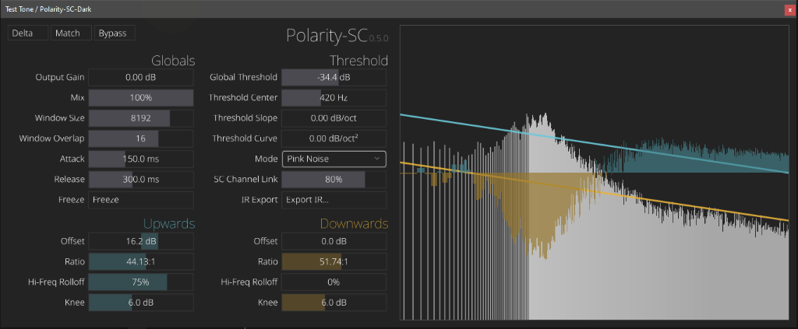

# Polarity-SC-Dark

Polarity-SC-Dark is an FFT-based spectral compressor built on top of a
vendored NIH-plug snapshot. The repository is organized as a plugin project
first: the product crate lives in `plugin/`, and the framework crates it
depends on live in `framework/`.

The current plugin feature set is intentionally focused on three compressor
modes:

- Pink Noise
- Sidechain Matching
- Sidechain Compression

Freeze and IR export remain part of the compressor workflow.



## Repository Layout

| Path | Purpose |
| --- | --- |
| `plugin/` | Polarity-SC-Dark crate: DSP, GUI, entry points, assets |
| `framework/nih_plug/` | Vendored NIH-plug core framework crate |
| `framework/nih_plug_derive/` | Vendored NIH-plug derive macros |
| `framework/nih_plug_vizia/` | Vendored VIZIA integration used by the plugin |
| `framework/nih_plug_xtask/` | Vendored bundling/tooling library |
| `framework/xtask/` | `cargo xtask` entry point |
| `framework/cargo_nih_plug/` | Optional `cargo nih-plug` wrapper |
| `docs/` | Project-specific technical notes |
| `docs/user-feedback` | Feature Requests and Reports by users. Each user a markdown file |


## Build

After installing [Rust](https://rustup.rs/), bundle the plugin with:

```shell
rustup run stable cargo xtask bundle polarity_sc_dark --release
```

Artifacts are written to `target/bundled/`.

To build just the plugin crate:

```shell
rustup run stable cargo build -p polarity_sc_dark
```

To run the standalone binary:

```shell
rustup run stable cargo run -p polarity_sc_dark --bin polarity_sc_dark_standalone --release
```

## GUI Development

The plugin theme lives at `plugin/src/editor/theme.css`. Use the `hot-reload`
feature to load the CSS from disk at runtime:

```shell
cargo run -p polarity_sc_dark --bin polarity_sc_dark_standalone --features hot-reload
```

Close and reopen the editor window after editing `plugin/src/editor/theme.css`.

## Notes

- All vendored NIH-plug crates live under `framework/` because I like it.
- `bundler.toml` is intentionally scoped to this single plugin.
